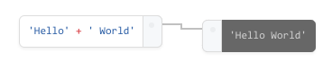
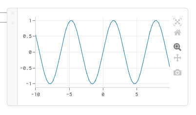
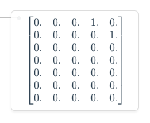
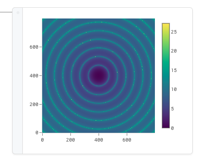

### *Please note*

Prairie was created in 2018 as an experiment and is no longer being developed. For a proper Python-friendly workflow manager, have a look at [orchest](https://www.orchest.io/) (visual), or general options like [Apache workflow](https://airflow.apache.org/) and [snakemake](https://snakemake.readthedocs.io/en/stable/)

# Prairie


Prairie is a **visual programming** environment aimed at scientists and engineers. It's an **experiment** that tries to provide a natural and intuitive interface for **visualizing** and **interacting** with complex data processing pipelines developed in **Python**.

<p align="center">
  
</p>


## Overview

**Prairie** is neither meant to replace traditional IDEs nor develop pipelines from scratch. Instead, it is designed as a **functional tool** that goes on top of your **libraries, class, functions** and complement your pipelines with rich and extendable **interactive widgets**.

Main features include:

- Dragging and dropping your existing class/functions **directly from your python files**

<p align="center">
  
</p>

- Using interactive widgets to **interact with your data** : 


<div style='display:flex;flex-direction:row;align-items:center;justify-content:center;'>
        <div align='center'>
    	
        <p><i>Code blocks</i></p>
   	</div>
    <div align='center'>
        
        <p><i>Plot block (using plotly)</i></p>
    </div>
<div>

<div style='display:flex;flex-direction:row;align-items:center;justify-content:center;'>
    <div align='center'>
        
        <p><i>Matrix block</i></p>
    </div>
    <div align='center'>
    	
        <p><i>Image block</i></p>
   	</div>
<div>

- **and much more** (Prairie would provide an API to create custom blocks - *not included in the current version*) ...


## Blocks and Widgets libraries

### Libraries

*note: Libraries extension features are not included in the current git version*

**Prairie** would come with out-of-the-box **block libraries** that can be extended with **custom and community-made libraries** and blocks. Libraries could be installed **like python packages**:

```shell
pip install prairie-<library-name>
# or
pipenv install prairie-<library-name>
```

and then become available on the interface, **loaded with your python interpreter** (pipenv/ virtualenv are advised).

### Default set

See the [features list](doc/features_list.md) and the [prairie blocks icons](doc/prairie-icons.md) files to learn more about default blocks included when installing Prairie


<p align="center">
  
    <p align="center"><i>some Prairie block icons</i></p>
</p>


## General considerations

**Prairie** provides notebook-like functionalities (see [Jupyter lab](https://jupyterlab.readthedocs.io/en/stable/getting_started/overview.html)) in a **functional block-diagram interface**. As it is, Prairie **does not bring unique enough features** compared to Jupyter notebooks - *developer opinion* - which is the main reason why its **development has been stopped**. Nonetheless, it is a good starting point for anyone that would like to develop such an interface for a specific use (e.g. similar to [LabView](http://www.ni.com/nl-nl/shop/labview.html), [Simulink](https://www.mathworks.com/products/simulink.html) or any block-diagram GUI). **Contact**, through github issues or mail, is **open** for any kind of **initiative or support**.